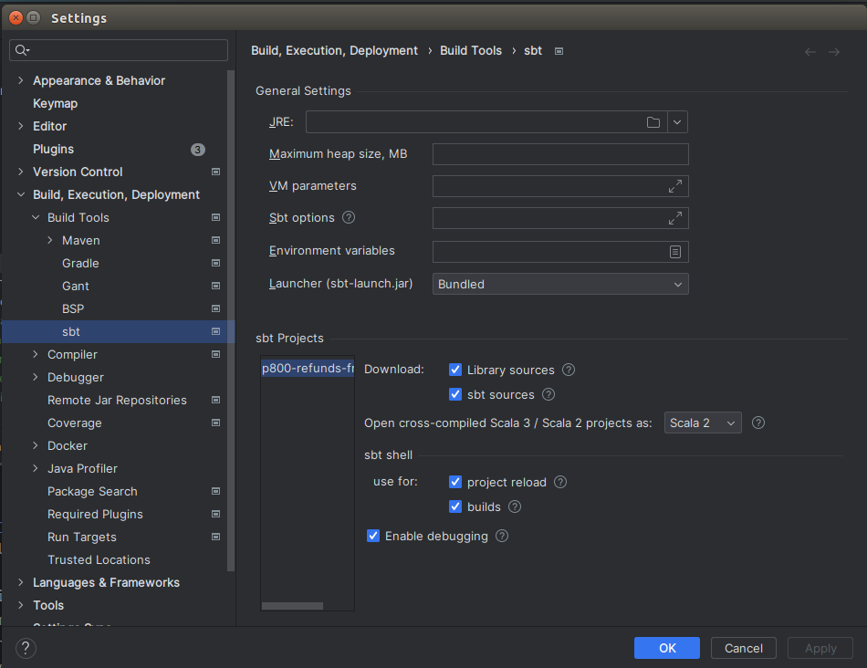

# Overview agent-registration-frontend

TODO
This is a new service. No overview yet.

# Running the Service

To start the service, use the following commands:

- `sbt runTestOnly` - this enables extra test endpoints
- `sbt run` to launch the service normally.

After starting the service, open in browser:
[`http://localhost:22201/agent-registration](http://localhost:22201/agent-registration)

Ensure that all dependent applications, including MongoDB and other microservices, are also running.
To start/stop these dependent services, use the Service Manager commands:

```bash
sm2 --start AGENT_REGISTRATION_ALL \
&& sm2 -s
```

```bash
sm2 -stop-all \
&& sm2 -s
```

In addition, if you are running this service from source and intending to upload AMLS evidence files in localhost then
you may also need to initialise an internal auth token used for object-store transfers by running the following command:

```bash
./setup-object-store.sh
```

## Using the GRS stub and company numbers

We have a stub (which is configured to be on in localhost by default) for the GRS service which allows us to specify
outcome data including Company Registration Numbers for incorporated business types. If we want to access predefined
company officer lists we can use company numbers from the following table:

| Company Type                  | Number of active officers | Company Number |
|-------------------------------|---------------------------|----------------|
| Limited Company               | 2                         | 11111111       |
| Limited Company               | 6                         | 11111116       |
| Limited Liability Partnership | 2                         | 22222222       |
| Limited Liability Partnership | 6                         | 22222226       |
| Limited Partnership           | 2                         | 33333333       |
| Limited Partnership           | 6                         | 33333336       |
| Scottish Limited Partnership  | 2                         | 44444444       |
| Scottish Limited Partnership  | 6                         | 44444446       |

# Project Setup in IntelliJ

When importing a project into IntelliJ IDEA, it is recommended to configure your setup as follows to optimize the
development process:

1. **SBT Shell Integration**: Utilize the sbt shell for project reloads and builds. This integration automates project
   discovery and reduces issues when running individual tests from the IDE.

2. **Enable Debugging**: Ensure that the "Enable debugging" option is selected. This allows you to set breakpoints and
   use the debugger to troubleshoot and fine-tune your code.

3. **Library and SBT Sources**: For those working on SBT project definitions, make sure to include "library sources"
   and "sbt sources." These settings enhance code navigation and comprehension by providing access to the underlying SBT
   and library code.

Here is a visual guide to assist you in setting up:


## Project specific sbt commands

### Turn off strict building

In sbt command in intellij:

```
sbt> relax
```

This will turn off strict building for this sbt session.
When you restart it, or you build on jenkins, this will be turned on.

### Run with test only endpoints

```
sbt> runTestOnly
```

### Run tests before check in

```
sbt> clean test
```

### License

This code is open source software licensed under
the [Apache 2.0 License]("http://www.apache.org/licenses/LICENSE-2.0.html").