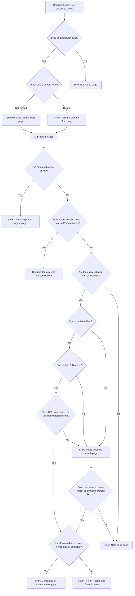

```mermaid
flowchart TD
    M[Unauthenticated user accesses LinkId] --> N{does an application exist?}
    N --> |Yes| O{check status of application}
    N --> |No| p[Show Not Found page]
    O --> |Not Risked| Q[Show Provide Details Start page]
    O --> |Risked| R[Show Risking Outcome Start page]
    Q --> A
    R --> A
    A[Sign in with Creds] --> B{are creds with Agent affinity?}
    B -->|Yes| C[Show Cannot Sign in As Agent page]
    B -->|No| E{Does InternalUserId match existing Person Record?}
    E --> |Yes| F[Resume Journey with Person Record]
    E --> |No| G{Are there any unlinked Person Records?}
    G --> |Yes| H{Does user have Nino?}
    G --> |No| I[Show Not Found page]
    H --> |Yes| J{Can we find CiD record?}
    H --> |No| K[Show Name Matching search page]
    J --> |Yes| L{Does CiD Name match an unlinked Person Record?}
    J --> |No| K
    L --> |Yes| S{Has Person Record been completed by applicant?}
    L --> |No| K
    S --> |Yes| T[Show Completed by someone else page]
    S --> |No| U[Claim Person Record and Start Journey]
    K --> V{Does user entered name match an available Person Record?}
    V --> |Yes| S
    V --> |No| I
```
