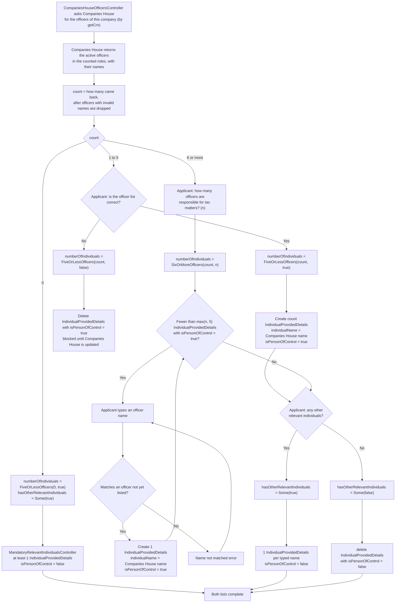

# Creating individuals for an incorporated business

Part of [Individuals on an application](individuals.md).

Applies to [incorporated businesses](glossary.md#incorporated-business): `AgentApplicationLimitedCompany`,
`AgentApplicationLlp`, `AgentApplicationLimitedPartnership` and `AgentApplicationScottishLimitedPartnership`. The
examples use `AgentApplicationLimitedCompany`; the other three change the same fields in the same way.

Before the task starts, after [GRS](glossary.md#grs):

```scala
AgentApplicationLimitedCompany(
  numberOfIndividuals = None,
  hasOtherRelevantIndividuals = None,
  ...
)
```


