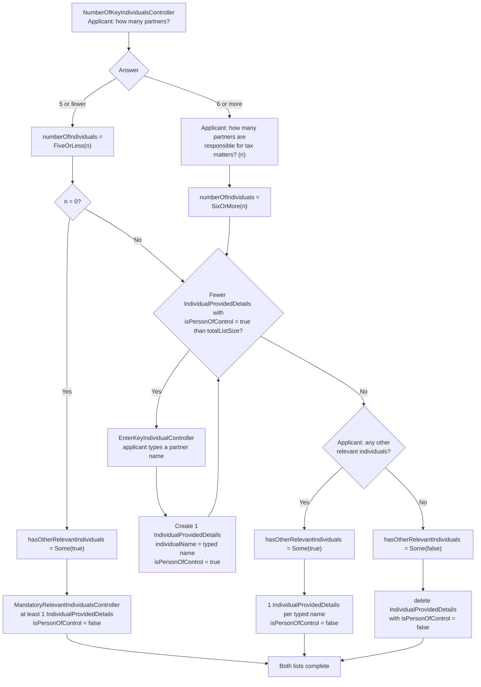

# Creating individuals for a partnership

Part of [Individuals on an application](individuals.md).

Applies to [general partnerships](glossary.md#partnership) and [Scottish partnerships](glossary.md#partnership):
`AgentApplicationGeneralPartnership` and `AgentApplicationScottishPartnership`.

