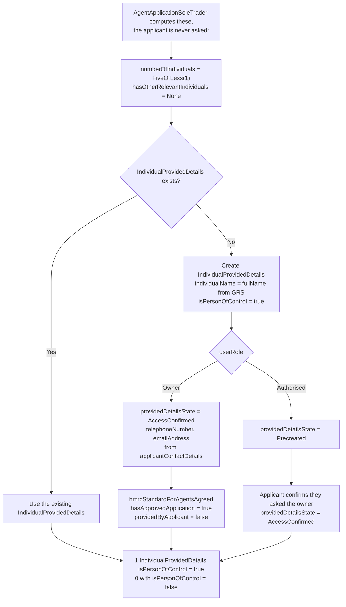

# Creating individuals for a sole trader

Part of [Individuals on an application](individuals.md).

```mermaid
flowchart TD
    A["AgentApplicationSoleTrader computes these,<br/>the applicant is never asked:"]
    A2["numberOfIndividuals = FiveOrLess(1)<br/>hasOtherRelevantIndividuals = None"]
    E{"IndividualProvidedDetails exists?"}
    U["Use the existing IndividualProvidedDetails"]
    R{"userRole"}
    CR["Create IndividualProvidedDetails<br/>individualName = fullName from GRS<br/>isPersonOfControl = true"]
    O1["providedDetailsState = AccessConfirmed<br/>telephoneNumber, emailAddress<br/>from applicantContactDetails"]
    O2["hmrcStandardForAgentsAgreed<br/>hasApprovedApplication = true<br/>providedByApplicant = false"]
    P1["providedDetailsState = Precreated"]
    P2["Applicant confirms they asked the owner<br/>providedDetailsState = AccessConfirmed"]
    D["1 IndividualProvidedDetails isPersonOfControl = true<br/>0 with isPersonOfControl = false"]
    A --> A2 --> E
    E -->|Yes| U --> D
    E -->|No| CR --> R
    R -->|Owner| O1 --> O2 --> D
    R -->|Authorised| P1 --> P2 --> D
```
