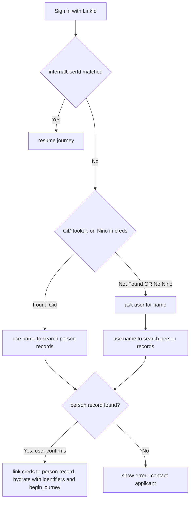

```mermaid
flowchart TD
    A[Sign in with LinkId] --> B{internalUserId matched}
    B -->|Yes| C[resume journey]
    B ---->|No| E{CiD lookup on Nino in creds}
    E -->|Found Cid| G[use name to search person records]
    E -->|Not Found OR No Nino| H[ask user for name]
    H --> I[use name to search person records]
    G & I --> J{person record found?}
    J -->|Yes, user confirms| K[link creds to person record, hydrate with identifiers and begin journey]
    J -->|No| L[show error - contact applicant]
```
