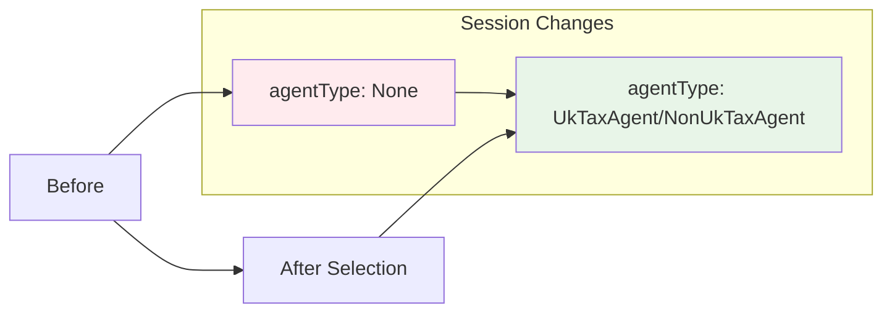
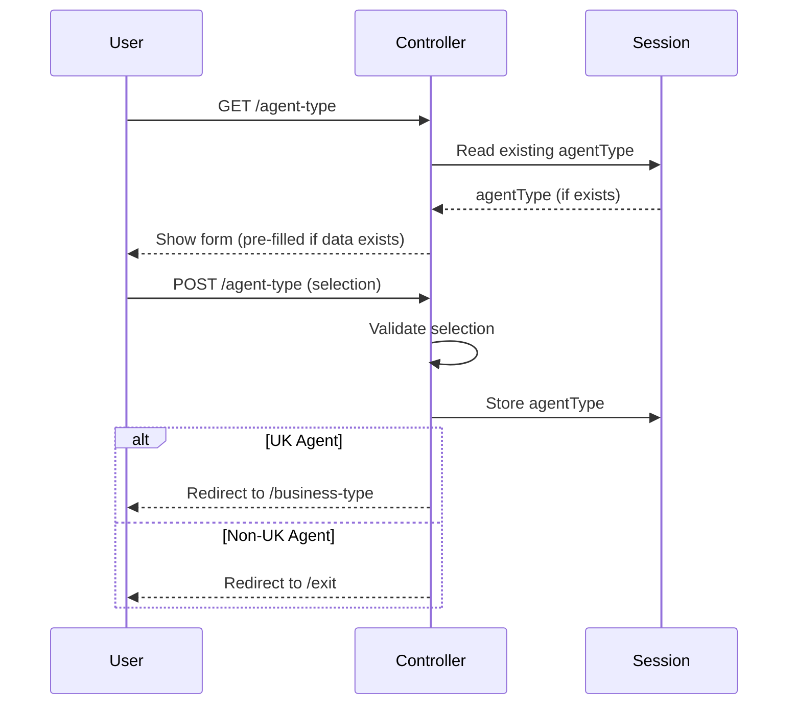

# AgentTypeController Journey

## Overview

First critical decision point determining UK vs Non-UK agent path.

## Session Data

**Stored Data:**

- `agentType: AgentType` (UkTaxAgent | NonUkTaxAgent)

## User Flow

## API Calls

**None** - No downstream API calls. Session-only operations.

## Navigation Logic

| Selection | Next Step | Reason |
|-----------|-----------|--------|
| UkTaxAgent | `/business-type` | Continue UK registration flow |
| NonUkTaxAgent | `/exit` | Non-UK agents not supported |

## Key Business Rules

- UK agents proceed to full registration
- Non-UK agents are directed to exit (service limitation)
- Selection stored in session for task list progress tracking
