# AML Evidence Upload Journey

## Quick Overview

Secure document upload using Upscan with real-time progress tracking and virus scanning.

## Session State Evolution


## Upload Sequence Diagram


## File Upload State Machine


## Technical Architecture

### Controller Actions Map


### Session State Updates

```scala
// Initial state
.modify(_.amlsDetails.each.amlsEvidence)
.setTo(Some(UploadDetails(
  status = UploadStatus.InProgress,
  reference = fileReference
)))

// Success state  
.setTo(Some(UploadDetails(
  status = UploadStatus.UploadedSuccessfully(url, fileName),
  reference = fileReference
)))
```

## AJAX Polling Mechanism


## Security & File Validation

```mermaid
graph TD
    A[File Upload] --> B{Size Check}
    B -->|> 5MB| C[Too Large]
    B -->|≤ 5MB| D{Type Check}
    
    D -->|Invalid| E[Wrong Type]
    D -->|PDF/JPG/PNG| F[Virus Scan]
    
    F -->|Clean| G[Store Securely]
    F -->|Infected| H[Quarantine]
    F -->|Scan Failed| I[Processing Error]
    
    style C fill:#ffcdd2
    style E fill:#ffcdd2
    style H fill:#ff8a65
    style I fill:#ffcdd2
    style G fill:#c8e6c9
```



## Performance Profile

| Metric | Value | Notes |
|--------|-------|-------|
| Upload Speed | Variable | Network dependent |
| Virus Scan | 10-30s | Upscan processing |
| Polling Interval | 2s | Configurable |
| Max File Size | 5MB | Security limit |
| Timeout | 10min | Upload limit |

## Error Handling Matrix

| Error Type | HTTP Code | User Experience | Session Impact |
|------------|-----------|-----------------|----------------|
| File Too Large | 400 | Size guidance | No change |
| Wrong Type | 400 | Format list | No change |
| Virus Found | 409 | Security warning | Status: Failed |
| Network Fail | 400 | Retry option | Status: Failed |
| Service Down | 500 | Try later | No change |

- **204 No Content**: Upload still in progress
- **202 Accepted**: Upload completed successfully  
- **409 Conflict**: File quarantined (virus detected)
- **400 Bad Request**: Upload failed
