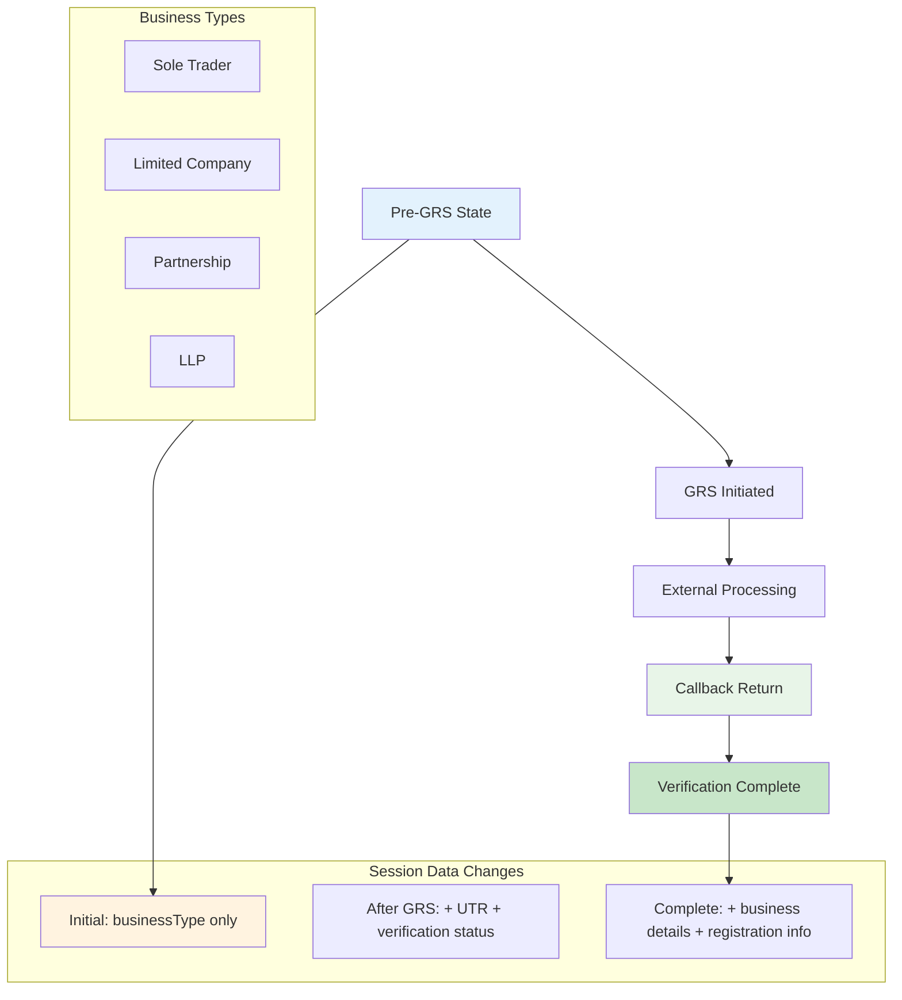
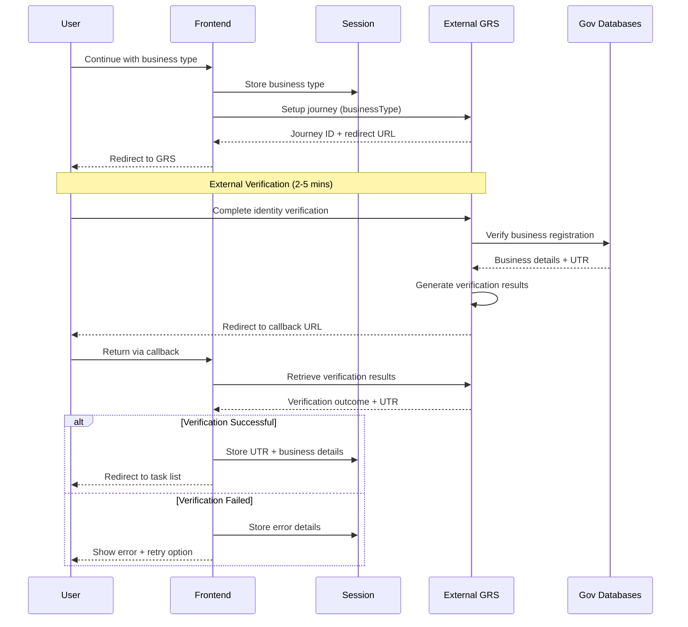
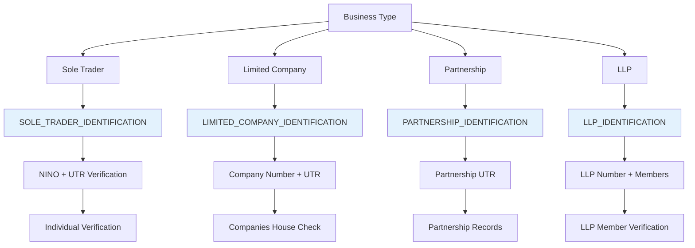
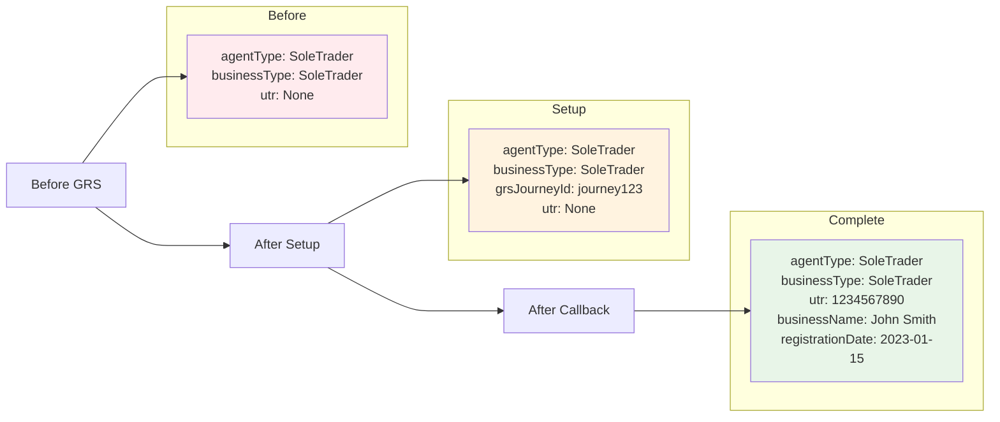
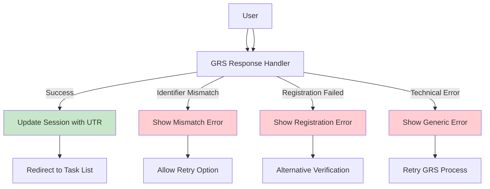
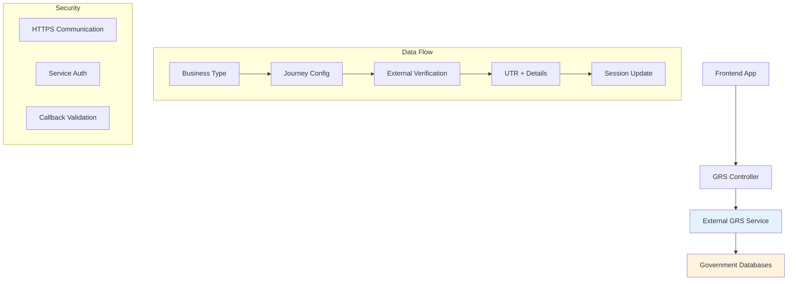

# Government Registration Service (GRS) Integration

## Quick Overview

External service integration for business verification with UTR generation and callback handling.

## Session State Evolution During GRS Journey



## GRS Integration Sequence



## Business Verification Types



## Implementation Details

### Controller Actions

```scala
// Journey Setup
def setUpGrsFromSignIn(agentType: AgentType, businessType: BusinessType)

// Callback Processing  
def journeyCallback(businessType: BusinessType, journeyId: JourneyId)
```

### Session Data Transformations



## Error Handling Scenarios



## Integration Architecture



## Performance & Reliability

| Metric | Value | Notes |
|--------|-------|-------|
| GRS Response | 2-5 minutes | User completes verification |
| Callback Speed | < 1 second | Return processing |
| Success Rate | 99.9% | GRS service SLA |
| Retry Options | Unlimited | User can retry failed attempts |
