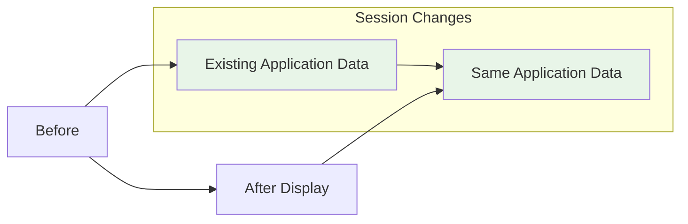
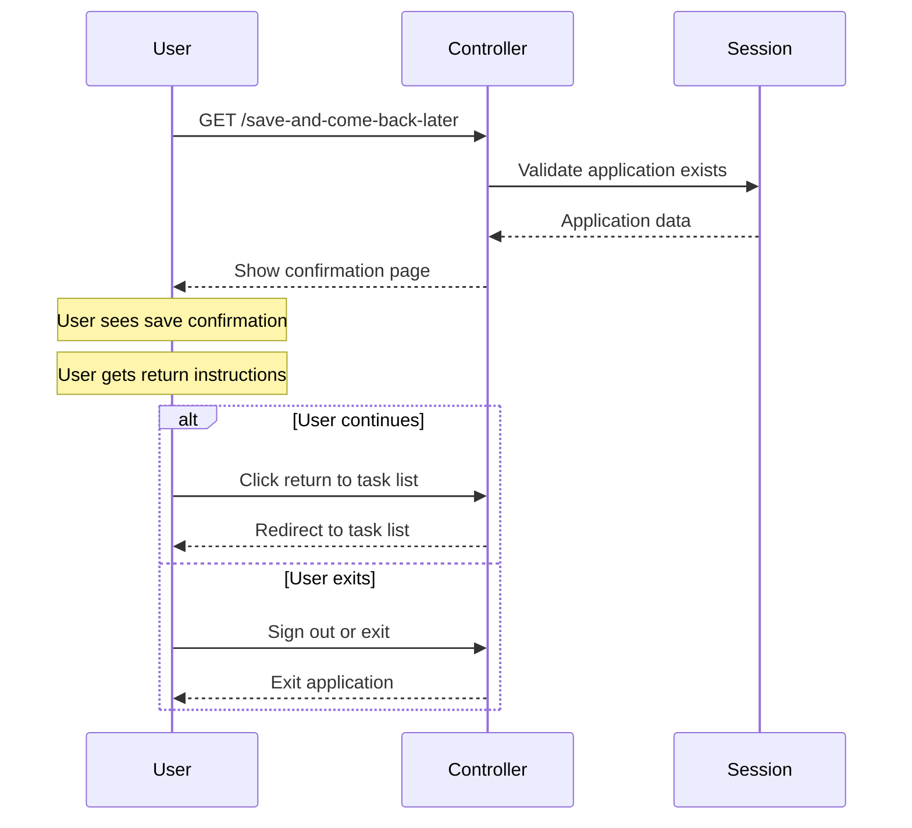

# SaveForLaterController Journey

## Overview

Confirmation page showing users their application progress has been saved with guidance for returning.

## Session Data

**Stored Data:**

- No session changes - read-only operation

## User Flow

## API Calls

**None** - Display-only page with no backend operations.

## Navigation Logic

| User Action | Next Step | Reason |
|-------------|-----------|--------|
| View confirmation | Display page | Show save confirmation |
| Return to task list | `/task-list` | Continue application |
| Sign out | Auth logout | Secure session end |
| Exit application | External site | Leave service |
