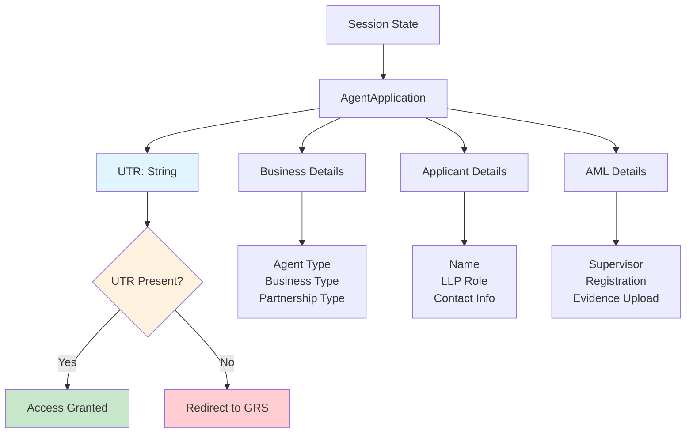
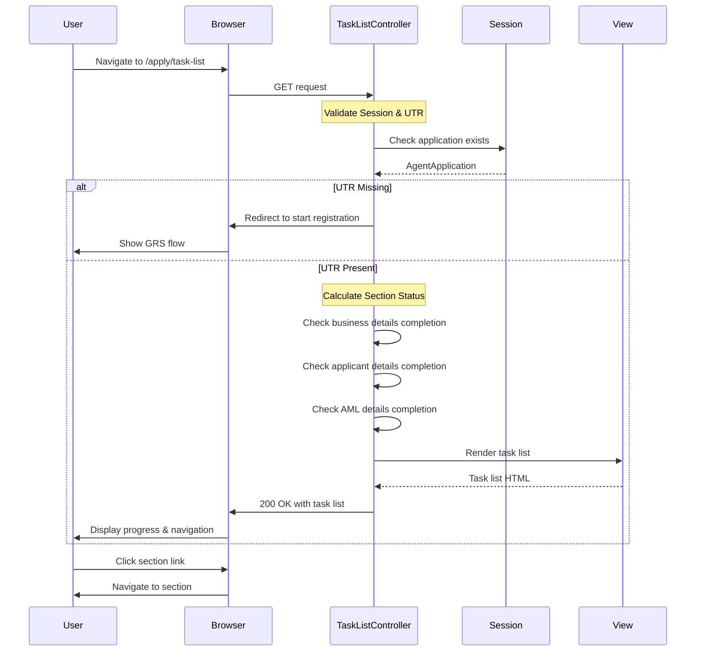
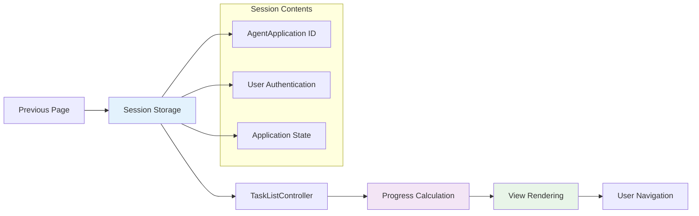
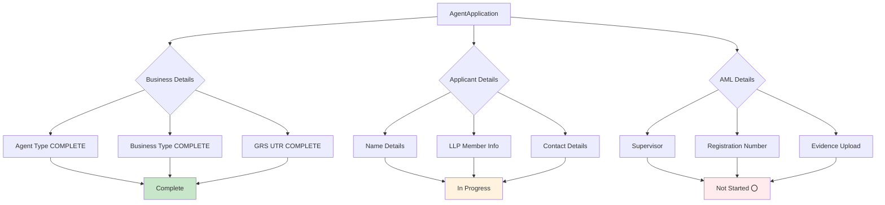
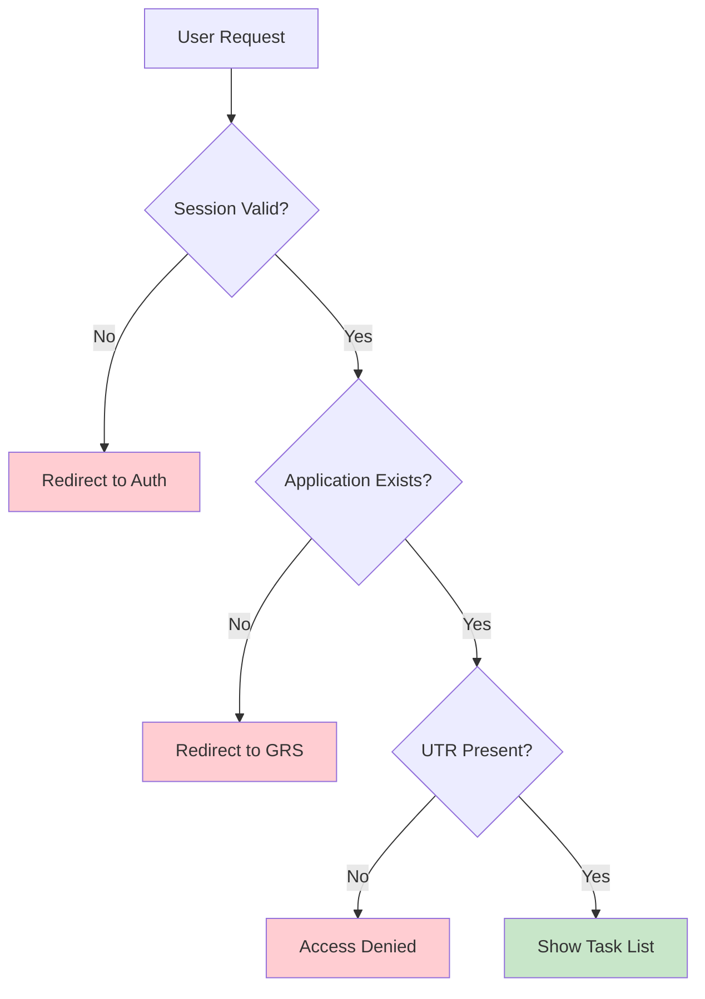
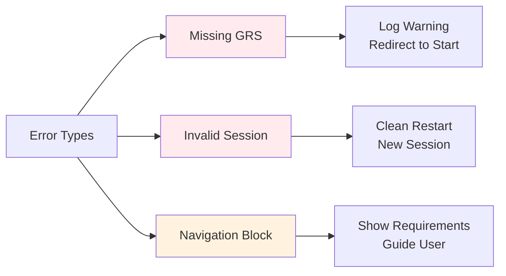

# Task List Navigation Hub

## Quick Overview

Central navigation hub displaying application progress with GRS verification enforcement.

## Session State Model

## User Journey Sequence

## Session Data Flow

## Technical Architecture

### Section Status Logic

## Security & Access Control

## Error Scenarios

## Performance Profile

| Metric | Value | Notes |
|--------|-------|-------|
| Response Time | < 100ms | Minimal processing |
| Template Render | < 50ms | Static + dynamic data |
| DB Queries | 1 | Session application only |
| Memory Usage | Low | Stateless operation |
| Scalability | High | No server state |
