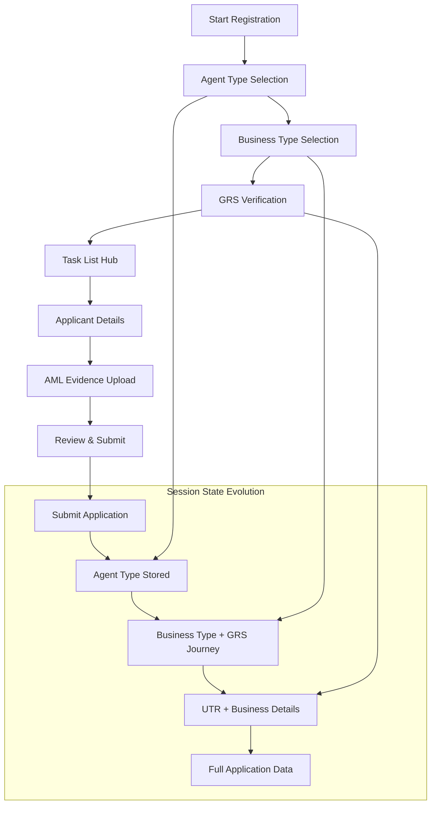
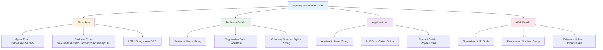
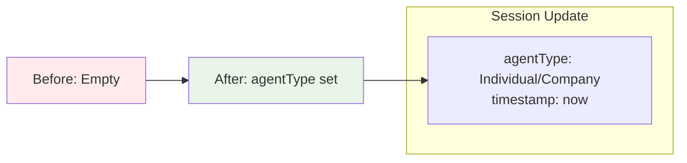
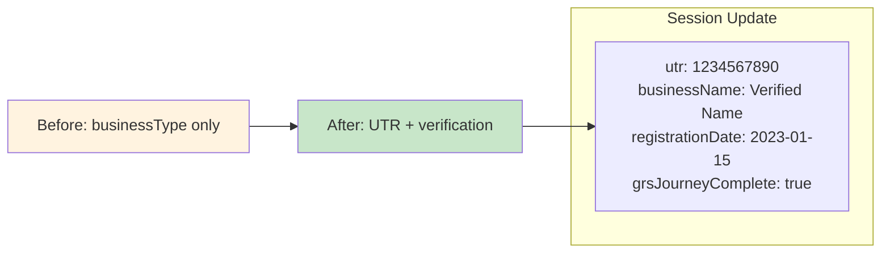
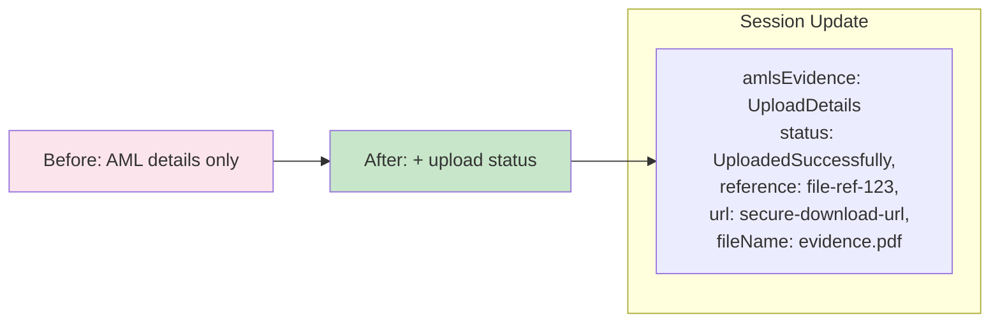
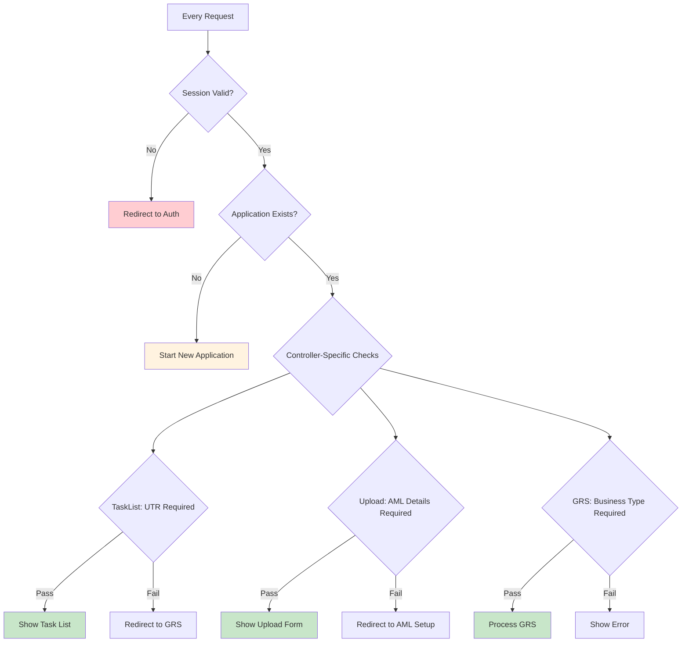
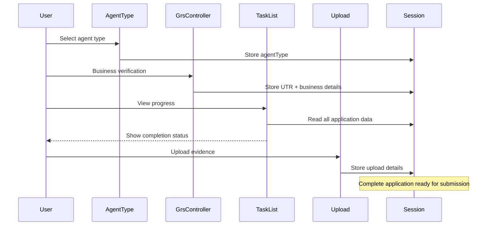
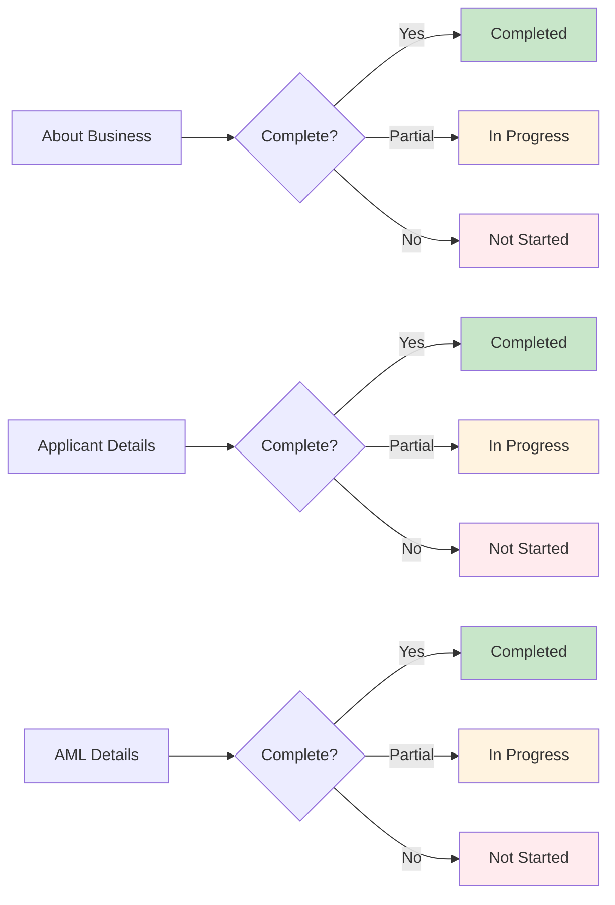
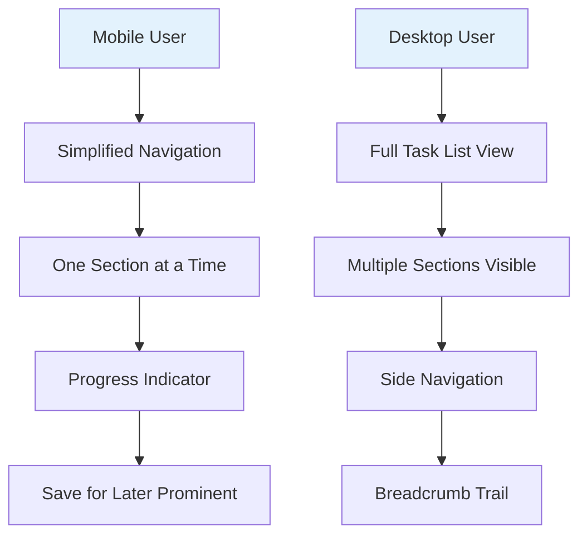
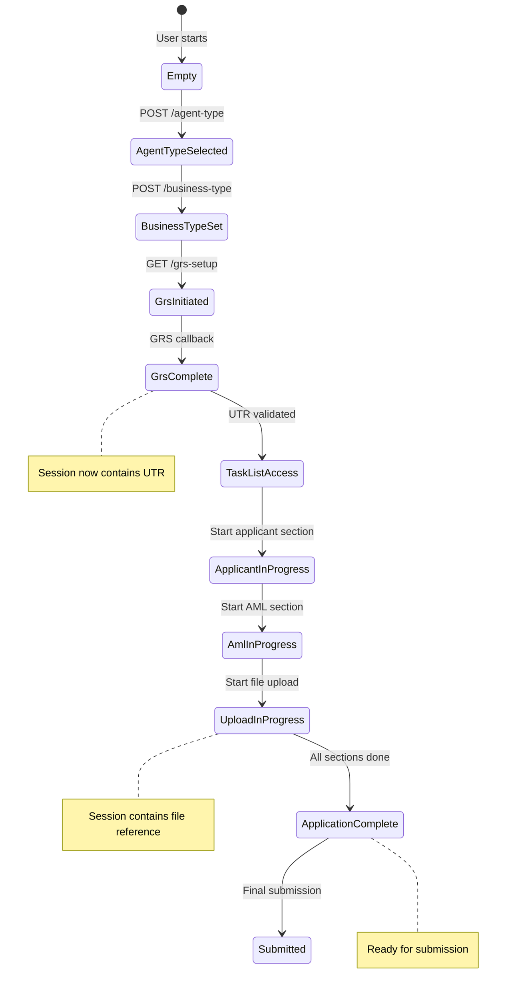

# Agent Registration - Visual Journey Overview

## Complete User Journey Flow



## Session Data Model Across Controllers



## Controller-Specific Session Changes

### AgentTypeController



### GrsController  



### AmlsEvidenceUploadController



## Security & Validation Flow



## Data Flow Between Controllers



## UI State Indicators

### Task List Progress Visualization



## Responsive Design Patterns

### Mobile Journey Adaptation



## Debug & Monitoring Views

## Session Data Evolution by Screen

This section shows the deterministic progression of session data throughout the user journey, with deltas highlighting what changes at each step.

### Step 1: Agent Type Selection

**Screen**: `/apply/about-your-business/agent-type`

```yaml
# INITIAL STATE (Empty Session)
AgentApplication: null

# AFTER AGENT TYPE SELECTION
AgentApplication:
  id: "app-12345"
  userId: "user-67890" 
  createdAt: "2023-10-16T09:00:00Z"
  lastUpdated: "2023-10-16T09:05:00Z"
  agentType: "Individual"        # ← NEW: User's choice

# DELTA: +agentType, +metadata (id, userId, timestamps)
```

### Step 2: Business Type Selection  

**Screen**: `/apply/about-your-business/business-type`

```yaml
# BEFORE
AgentApplication:
  id: "app-12345"
  userId: "user-67890"
  createdAt: "2023-10-16T09:00:00Z"
  lastUpdated: "2023-10-16T09:05:00Z"
  agentType: "Individual"

# AFTER BUSINESS TYPE SELECTION
AgentApplication:
  id: "app-12345"
  userId: "user-67890" 
  createdAt: "2023-10-16T09:00:00Z"
  lastUpdated: "2023-10-16T09:07:00Z"    # ← UPDATED
  agentType: "Individual"
  businessType: "SoleTrader"              # ← NEW: User's choice

# DELTA: +businessType, updated lastUpdated
```

### Step 3: GRS Verification (External)

**Screen**: External GRS → Callback to `/apply/grs-callback`

```yaml
# BEFORE GRS
AgentApplication:
  id: "app-12345"
  userId: "user-67890"
  createdAt: "2023-10-16T09:00:00Z"
  lastUpdated: "2023-10-16T09:07:00Z"
  agentType: "Individual"
  businessType: "SoleTrader"

# AFTER GRS CALLBACK
AgentApplication:
  id: "app-12345"
  userId: "user-67890"
  createdAt: "2023-10-16T09:00:00Z"
  lastUpdated: "2023-10-16T09:15:00Z"     # ← UPDATED
  agentType: "Individual"
  businessType: "SoleTrader"
  utr: "1234567890"                       # ← NEW: From GRS
  businessName: "John Smith Trading"      # ← NEW: From GRS  
  registrationDate: "2023-01-15"         # ← NEW: From GRS
  grsJourneyComplete: true                # ← NEW: Journey flag

# DELTA: +utr, +businessName, +registrationDate, +grsJourneyComplete
```

### Step 4: Task List Access

**Screen**: `/apply/task-list`

```yaml
# NO CHANGES - Read-only screen that displays current state
# Task list uses existing session data to show progress indicators

AgentApplication: # Same as Step 3
  id: "app-12345"
  userId: "user-67890"
  createdAt: "2023-10-16T09:00:00Z"
  lastUpdated: "2023-10-16T09:15:00Z"
  agentType: "Individual"
  businessType: "SoleTrader"
  utr: "1234567890"
  businessName: "John Smith Trading"
  registrationDate: "2023-01-15"
  grsJourneyComplete: true

# DELTA: None (read-only navigation)
```

### Step 5: Applicant Details

**Screen**: `/apply/applicant/*` (multiple screens)

```yaml
# AFTER APPLICANT DETAILS COMPLETION
AgentApplication:
  id: "app-12345"
  userId: "user-67890"
  createdAt: "2023-10-16T09:00:00Z"
  lastUpdated: "2023-10-16T09:25:00Z"     # ← UPDATED
  agentType: "Individual"
  businessType: "SoleTrader"
  utr: "1234567890"
  businessName: "John Smith Trading"
  registrationDate: "2023-01-15"
  grsJourneyComplete: true
  
  applicantDetails:                       # ← NEW: Entire section
    name: "John Smith"
    telephone: "+44 1234 567890"
    email: "john.smith@example.com"
    dateOfBirth: "1980-05-15"

# DELTA: +applicantDetails (name, telephone, email, dateOfBirth)
```

### Step 6: AML Supervisor Selection

**Screen**: `/apply/anti-money-laundering/supervisor`

```yaml
# AFTER AML SUPERVISOR SELECTION
AgentApplication:
  # ... all previous data unchanged ...
  lastUpdated: "2023-10-16T09:30:00Z"     # ← UPDATED
  
  amlsDetails:                            # ← NEW: AML section starts
    supervisoryBody: "HMRC"

# DELTA: +amlsDetails.supervisoryBody
```

### Step 7: AML Registration Number

**Screen**: `/apply/anti-money-laundering/registration-number`

```yaml
# AFTER AML REGISTRATION NUMBER
AgentApplication:
  # ... all previous data unchanged ...
  lastUpdated: "2023-10-16T09:32:00Z"     # ← UPDATED
  
  amlsDetails:
    supervisoryBody: "HMRC"
    registrationNumber: "AML123456"       # ← NEW: Registration number

# DELTA: +amlsDetails.registrationNumber
```

### Step 8: AML Evidence Upload

**Screen**: `/apply/anti-money-laundering/evidence`

```yaml
# DURING UPLOAD (In Progress)
AgentApplication:
  # ... all previous data unchanged ...
  lastUpdated: "2023-10-16T09:35:00Z"     # ← UPDATED
  
  amlsDetails:
    supervisoryBody: "HMRC"
    registrationNumber: "AML123456"
    evidence:                             # ← NEW: Upload tracking
      status: "InProgress"
      reference: "file-ref-123"

# AFTER SUCCESSFUL UPLOAD
AgentApplication:
  # ... all previous data unchanged ...
  lastUpdated: "2023-10-16T09:38:00Z"     # ← UPDATED
  
  amlsDetails:
    supervisoryBody: "HMRC"
    registrationNumber: "AML123456"
    evidence:                             
      status: "UploadedSuccessfully"      # ← UPDATED: Success
      reference: "file-ref-123"
      fileName: "aml-certificate.pdf"     # ← NEW: File details
      url: "secure-download-url"          # ← NEW: Secure URL
      uploadedAt: "2023-10-16T09:38:00Z"  # ← NEW: Upload timestamp

# DELTA: evidence.status→Success, +fileName, +url, +uploadedAt
```

### Step 9: Application Complete

**Screen**: `/apply/task-list` (final state)

```yaml
# FINAL COMPLETE STATE
AgentApplication:
  id: "app-12345"
  userId: "user-67890"
  createdAt: "2023-10-16T09:00:00Z"
  lastUpdated: "2023-10-16T09:38:00Z"
  agentType: "Individual"
  businessType: "SoleTrader"
  utr: "1234567890"
  businessName: "John Smith Trading"
  registrationDate: "2023-01-15"
  grsJourneyComplete: true
  
  applicantDetails:
    name: "John Smith"
    telephone: "+44 1234 567890"
    email: "john.smith@example.com"
    dateOfBirth: "1980-05-15"
    
  amlsDetails:
    supervisoryBody: "HMRC"
    registrationNumber: "AML123456"
    evidence:
      status: "UploadedSuccessfully"
      reference: "file-ref-123"
      fileName: "aml-certificate.pdf"
      url: "secure-download-url"
      uploadedAt: "2023-10-16T09:38:00Z"

# DELTA: None - Ready for submission
```

## Session Data Size Progression

| Step | Screen | Fields Added | Total Fields | Data Size (approx) |
|------|--------|--------------|--------------|-------------------|
| 1 | Agent Type | 4 | 4 | 150 bytes |
| 2 | Business Type | 1 | 5 | 170 bytes |
| 3 | GRS Callback | 4 | 9 | 280 bytes |
| 4 | Task List | 0 | 9 | 280 bytes |
| 5 | Applicant Details | 4 | 13 | 380 bytes |
| 6 | AML Supervisor | 1 | 14 | 400 bytes |
| 7 | AML Registration | 1 | 15 | 420 bytes |
| 8 | Evidence Upload | 4 | 19 | 520 bytes |

## Performance Metrics Dashboard

| Controller | Avg Response | Session Operations | External Calls |
|------------|-------------|-------------------|-----------------|
| AgentType | 45ms | 1 write | 0 |
| GrsController | 3.2s | 2 writes | 2 (GRS API) |
| TaskList | 35ms | 1 read | 0 |
| Upload | 85ms | 2 writes | 1 (Upscan) |
| CompaniesHouse | 1.8s | 1 write | 1 (CH API) |

## State Transition Map



This visual overview provides a comprehensive view of how session data evolves across the entire agent registration journey, making it easy to understand data flow and state management patterns.
