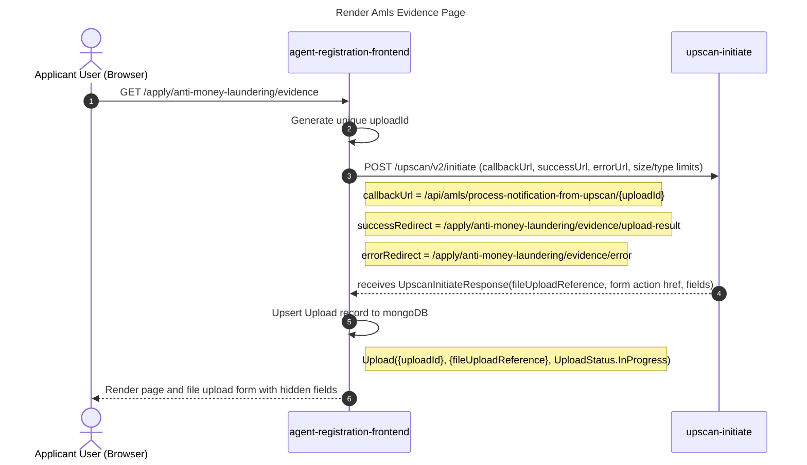
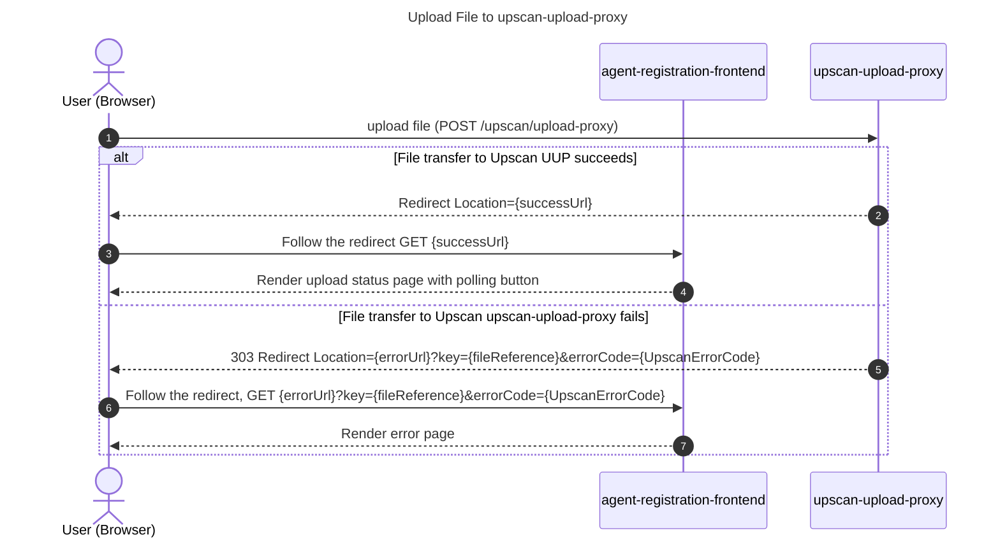
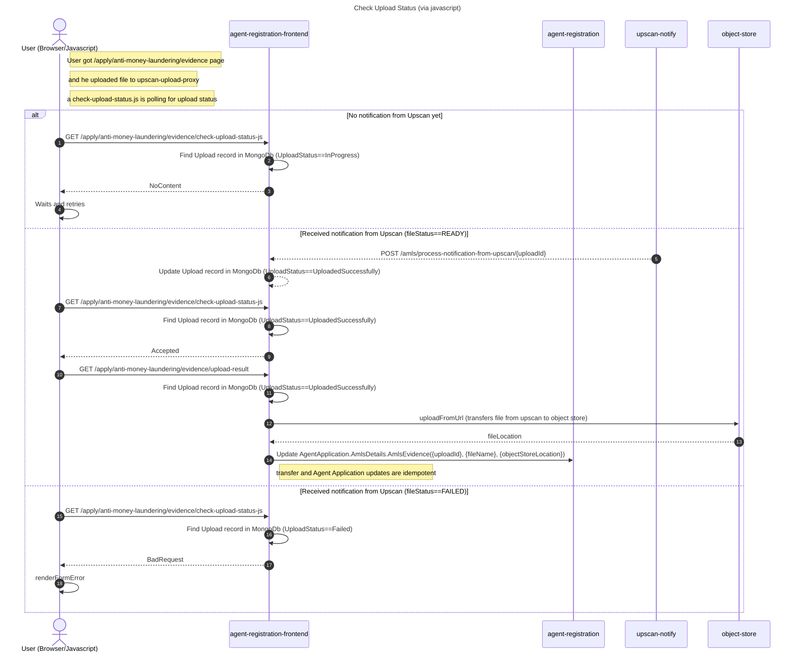
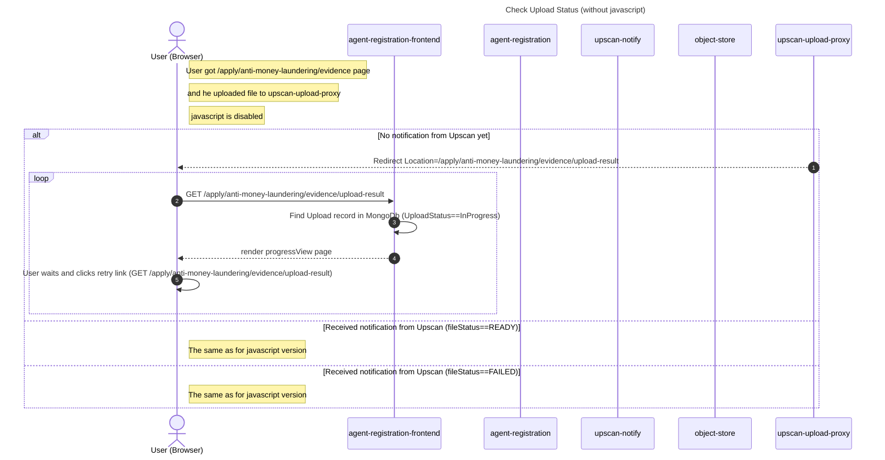

```mermaid
sequenceDiagram

title Render Amls Evidence Page 
autonumber

actor U as Applicant User (Browser)
participant FE as agent-registration-frontend
participant UI as upscan-initiate

U->>FE: GET /apply/anti-money-laundering/evidence 
FE->>FE: Generate unique uploadId
FE->>UI: POST /upscan/v2/initiate (callbackUrl, successUrl, errorUrl, size/type limits)
note right of FE: callbackUrl = /api/amls/process-notification-from-upscan/{uploadId}
note right of FE: successRedirect = /apply/anti-money-laundering/evidence/upload-result
note right of FE: errorRedirect = /apply/anti-money-laundering/evidence/error

    UI-->>FE: receives UpscanInitiateResponse(fileUploadReference, form action href, fields)
FE->>FE: Upsert Upload record to mongoDB
note right of FE:  Upload({uploadId}, {fileUploadReference}, UploadStatus.InProgress) 
FE-->>U: Render page and file upload form with hidden fields
```

```mermaid
sequenceDiagram

title Upload File to upscan-upload-proxy
autonumber

actor U as User (Browser)
participant FE as agent-registration-frontend
participant UUP as upscan-upload-proxy

U->>UUP: upload file (POST /upscan/upload-proxy)
alt File transfer to Upscan UUP succeeds
UUP-->>U: Redirect Location={successUrl}
U->>FE: Follow the redirect GET {successUrl}
FE-->>U: Render upload status page with polling button
else File transfer to Upscan upscan-upload-proxy fails
UUP-->>U: 303 Redirect Location={errorUrl}?key={fileReference}&errorCode={UpscanErrorCode}
U->>FE: Follow the redirect, GET {errorUrl}?key={fileReference}&errorCode={UpscanErrorCode}
FE-->>U: Render error page
end
```

```mermaid
sequenceDiagram
    title Check Upload Status (via javascript)
    autonumber
    actor U as User (Browser/Javascript)
    participant FE as agent-registration-frontend
    participant BE as agent-registration
    participant UN as upscan-notify
    participant OS as object-store
    note right of U: User got /apply/anti-money-laundering/evidence page
    note right of U: and he uploaded file to upscan-upload-proxy
    note right of U: a check-upload-status.js is polling for upload status
    alt No notification from Upscan yet
        U ->> FE: GET /apply/anti-money-laundering/evidence/check-upload-status-js
        FE ->> FE: Find Upload record in MongoDb (UploadStatus==InProgress)
        FE -->> U: NoContent
        U ->> U: Waits and retries

    else Received notification from Upscan (fileStatus==READY)
        UN -->> FE: POST /amls/process-notification-from-upscan/{uploadId}
        FE -->> FE: Update Upload record in MongoDb (UploadStatus==UploadedSuccessfully)
        U ->> FE: GET /apply/anti-money-laundering/evidence/check-upload-status-js
        FE ->> FE: Find Upload record in MongoDb (UploadStatus==UploadedSuccessfully)
        FE -->> U: Accepted
        U ->> FE: GET /apply/anti-money-laundering/evidence/upload-result
        FE ->> FE: Find Upload record in MongoDb (UploadStatus==UploadedSuccessfully)
        FE ->> OS: uploadFromUrl (transfers file from upscan to object store)
        OS -->> FE: fileLocation
        FE ->> BE: Update AgentApplication.AmlsDetails.AmlsEvidence({uploadId}, {fileName}, {objectStoreLocation})
        note right of FE: transfer and Agent Application updates are idempotent

    else Received notification from Upscan (fileStatus==FAILED)
        U ->> FE: GET /apply/anti-money-laundering/evidence/check-upload-status-js
        FE ->> FE: Find Upload record in MongoDb (UploadStatus==Failed)
        FE -->> U: BadRequest
        U ->> U: renderFormError
    end

```

```mermaid
sequenceDiagram
    title Check Upload Status (without javascript)
    autonumber
    actor U as User (Browser)
    participant FE as agent-registration-frontend
    participant BE as agent-registration
    participant UN as upscan-notify
    participant OS as object-store
    participant UUP as upscan-upload-proxy
    note right of U: User got /apply/anti-money-laundering/evidence page
    note right of U: and he uploaded file to upscan-upload-proxy
    note right of U: javascript is disabled

    alt No notification from Upscan yet
        UUP -->> U: Redirect Location=/apply/anti-money-laundering/evidence/upload-result
        loop
            U ->> FE: GET /apply/anti-money-laundering/evidence/upload-result
            FE ->> FE: Find Upload record in MongoDb (UploadStatus==InProgress)
            FE -->> U: render progressView page
            U ->> U: User waits and clicks retry link (GET /apply/anti-money-laundering/evidence/upload-result)
        end
    else Received notification from Upscan (fileStatus==READY)
        note right of U: The same as for javascript version  
    else Received notification from Upscan (fileStatus==FAILED)
        note right of U: The same as for javascript version
    end
```
