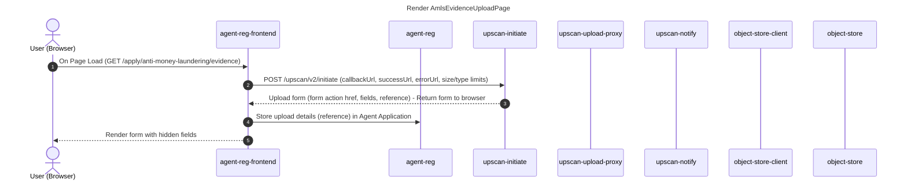
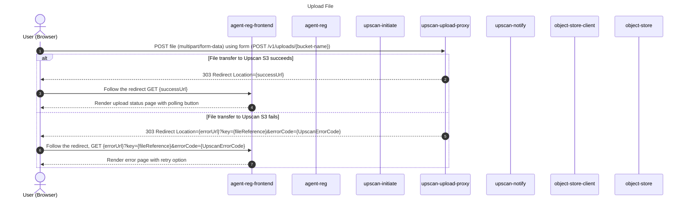
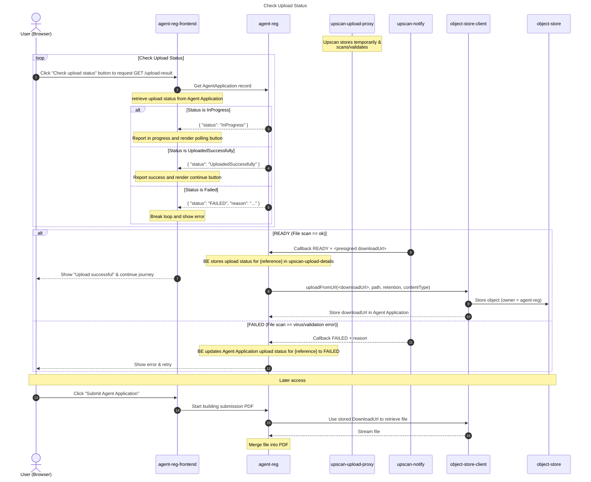

```mermaid
sequenceDiagram

title Render AmlsEvidenceUploadPage 
autonumber

actor U as User (Browser)
participant FE as agent-reg-frontend
participant BE as agent-reg
participant UI as upscan-initiate
participant S3 as upscan-upload-proxy
participant UN as upscan-notify
participant OSC as object‑store-client
participant OS as object-store

U->>FE: On Page Load (GET /apply/anti-money-laundering/evidence) 
FE->>UI: POST /upscan/v2/initiate (callbackUrl, successUrl, errorUrl, size/type limits)
UI-->>FE: Upload form (form action href, fields, reference) - Return form to browser
FE->>BE: Store upload details (reference) in Agent Application
FE-->>U: Render form with hidden fields

```

```mermaid
sequenceDiagram

title Upload File
autonumber

actor U as User (Browser)
participant FE as agent-reg-frontend
participant BE as agent-reg
participant UI as upscan-initiate
participant S3 as upscan-upload-proxy
participant UN as upscan-notify
participant OSC as object‑store-client
participant OS as object-store

U->>S3: POST file (multipart/form-data) using form (POST /v1/uploads/{bucket-name})

alt File transfer to Upscan S3 succeeds 
S3-->>U: 303  Redirect Location={successUrl}
U->>FE: Follow the redirect GET {successUrl}
FE-->>U: Render upload status page with polling button
else File transfer to Upscan S3 fails
S3-->>U: 303 Redirect Location={errorUrl}?key={fileReference}&errorCode={UpscanErrorCode}
U->>FE: Follow the redirect, GET {errorUrl}?key={fileReference}&errorCode={UpscanErrorCode}
FE-->>U: Render error page with retry option
end
```

```mermaid
sequenceDiagram

title Check Upload Status
autonumber

actor U as User (Browser)
participant FE as agent-reg-frontend
participant BE as agent-reg
participant S3 as upscan-upload-proxy
participant UN as upscan-notify
participant OSC as object‑store-client
participant OS as object-store

Note over S3: Upscan stores temporarily &<br/>scans/validates
loop Check Upload Status
U->>FE: Click "Check upload status" button to request GET /upload-result
FE->>BE: Get AgentApplication record
Note over FE: retrieve upload status from Agent Application
alt Status is InProgress
BE-->>FE: { "status": "InProgress" }
Note over FE: Report in progress and render polling button
else Status is UploadedSuccessfully
BE-->>FE: { "status": "UploadedSuccessfully" }
Note over FE: Report success and render continue button
else Status is Failed
BE-->>FE: { "status": "FAILED", "reason": "..." }
Note over FE: Break loop and show error
end
end
alt READY (File scan == ok)
UN->>BE: Callback READY + <presigned downloadUrl>
Note over BE: BE stores upload status for {reference} in upscan-upload-details
FE-->>U: Show "Upload successful" & continue journey
BE->>OSC: uploadFromUrl(<downloadUrl>, path, retention, contentType)
OSC->>OS: Store object (owner = agent-reg)
OSC-->>BE: Store downloadUrl in Agent Application
else FAILED (File scan == virus/validation error)
UN-->>BE: Callback FAILED + reason
Note over BE: BE updates Agent Application upload status for {reference} to FAILED
BE-->>U: Show error & retry
end
Note over U,OS: Later access
U->>FE: Click "Submit Agent Application"
FE->>BE: Start building submission PDF
BE->>OSC: Use stored DownloadUrl to retrieve file
OSC-->>BE: Stream file
Note over BE: Merge file into PDF
```